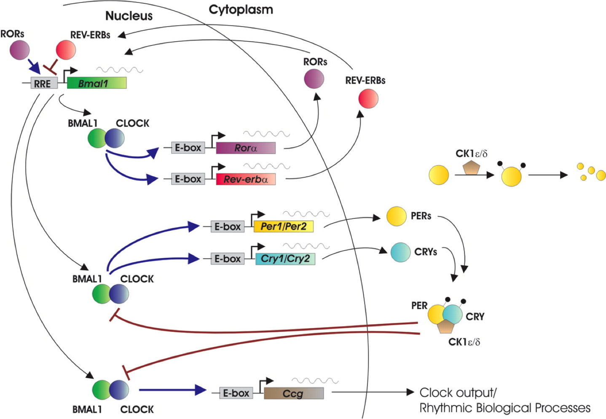

#### How do circadian rhythms work in a molecular level ?

Circadian rhythms originate from self-sustained, self-regulated expressions of clock genes, which are the molecular clocks. This molecular mechanism consists of transcription factors that activate and deactivate genes in the nucleus of each cell, this activation and deactivation leads to protein production necessary for the maintaince of a 24 hour cycle.

The molecular mechanism is initiated when the transcriptional activators Clock and Bmal1 heterodimerize, which stimulates transcription of target circadian genes including period _Per_ and cruptochorme _Cry_ and other clock controlled genes. 
 _Per_ and _Cry_ proteins heterodimerize and translocate to the nucleus of the cell, the accumulate of these proteins are transcriptional repressors of _Clock-Bmal1_, repressing these genes end the molecular circadian cycle. 
 
 Other proteins also regulate circadian rhythms, such as an enzyme sirtuin 1 _SIRT1_, histone deacetylase which removes acetyl groups and thus alters gene expression.

