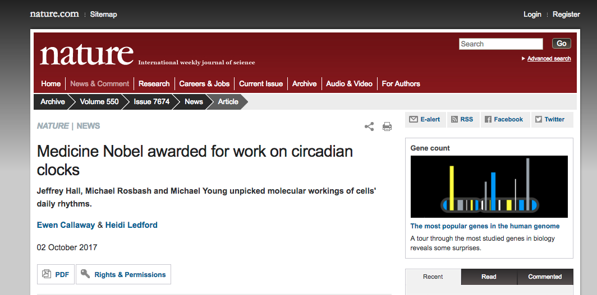

October 2017 

"Three scientists who studied the workings of organisms’ inner circadian clocks have won the 2017 Nobel Prize in Physiology or Medicine. Jeffrey Hall and Michael Rosbash, both at Brandeis University in Waltham, Massachusetts, will split the award of 9 million Swedish kronor (US$1.1 million) with Michael Young at Rockefeller University in New York City"

[Link to original Article](https://www.nature.com/news/medicine-nobel-awarded-for-work-on-circadian-clocks-1.22736)

