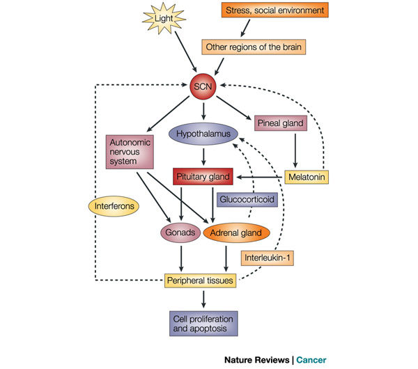

Circadian rhythms are endogenous biological processes that regulate sleep and wakefulness over a 24 hour period. These processes can be affected by nontraditional work schedules that include night shits, which require employers to be active during times where their biological clocks are programed to be inactive. Several studies have found that shift work is associated with disruption of circadian rhythms, which could potentiallly influenced immune dysfunction and increased risk for cancer(1).

###How Does Circadian Clocks Work?

The suprachiasmatic nucleus (SCN) is a region in the hypothalamus that is directly involve in circadian rhythms. The SCN is called the master clock  because it coordinates peripheral oscillators to regulate different body functions in a 24 hour cycle. Peripheral oscillators are cells that are located in the peripheral tissues, such as the thalamus, spleen, and kidney. 

###How does the SCN knows that is day or night ?

The SCN receives input from the environment through the photosensitive ganglion cells in the retina. These cells then sends input through the retinohypothalamic tract to cells in the ventrolateral SCN, the SCN then communiates to peripheral oscillators and tells them what time of the day is !

