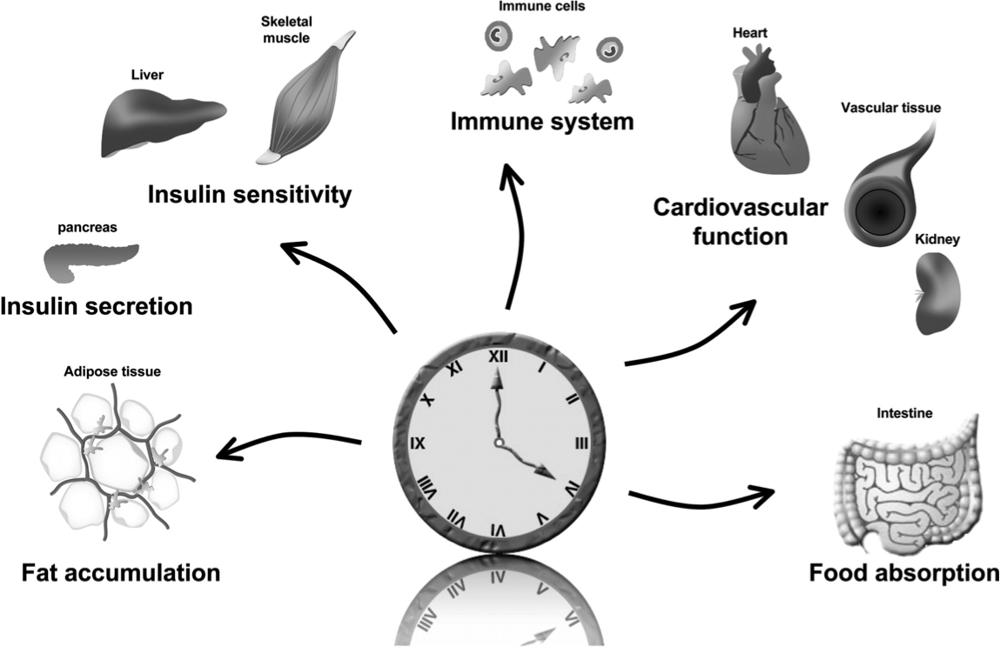
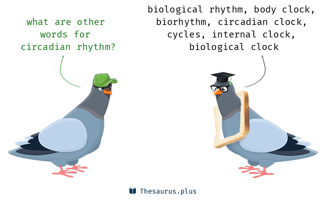

##HOME PAGE 
####In this website you will find general information about Circadian Rhythms!

This website is meant to introduce a general overview of circadian rhythms are and how do they work in our bodies. I would like to introduce some research that might suggest that circadian disruption might have potential adverse health problems such as cardiovascular diseases. 
 
#####What information would you find here ? 

* About Tab: What ar circadian rhythms
  + General Perspective 
* Topics: How do your body clocks work ?
  + Molecular Perspective 
  + Current Research:Literature that have made a significant impact in the field !
  + News in the field

